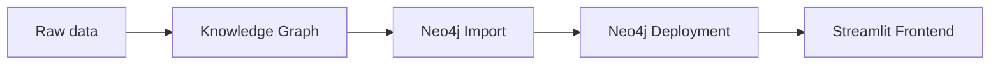

# Web app deployment

Finally, we can deploy a web application that uses the LLM. We will use the
[pole](https://github.com/biocypher/pole) example repository because it comes
with a small, self-contained dataset. Despite being a multi-component system, it
is easy to deploy on a VM due to its Docker setup.

The individual components in the workflow are:

- A BioCypher service that ingests the raw data and builds a Knowledge Graph
that is grounded in Ontology. This particular dataset contains synthetic data
about crimes committed in Manchester.

- Two Neo4j services that import and deploy the Knowledge Graph (to the
Docker network localhost address https://localhost:7474).

- The Streamlit-based BioChatter Light service, configured to use an Ollama LLM
and to show only one particular tab, the one that allows interaction with the
Knowledge Graph. This is similar in configuration to the BioChatter Light cancer
genetics use case ([DECIDER Light](https://decider-light.biochatter.org)).

> [!NOTE]
> The configuration of BioChatter light, including the LLM deployment and the
> shown tabs, is done in the environment. While this can be done in several
> ways, we use the `docker-compose-ollama.yml` file to set specific environment
> variables for the `app` service.

## Exercise

1. Clone the [pole](https://github.com/biocypher/pole) repository to your VM and
deploy the web application using Docker. What can you see? How can you interact
with the deployed web application?

> [!TIP]
> Useful Docker commands are:
> - `docker compose -f <file name> up -d` to start a specific Docker compose
> workflow in the background (`-d` = detached).
> - `docker compose -f <file name> down -v` to stop the workflow including the
> volumes (`-v`), which is where we create the Knowledge Graph.
> - `docker ps` to see which containers are running.
> - you may need to use `sudo` in front of the commands if you are missing
> permissions.
> - more info can be found in the [Docker
> documentation](https://docs.docker.com/compose/).

2. Try to use a different LLM in the web application. Which environment
variable do you need to change in the `docker-compose-ollama.yml` file?

3. If you have a suitable local PC with Docker and Ollama installed, you can try
the deployment on your own machine. This will allow you to see the web
applications that are started by the Docker compose workflow at
`http://localhost:8501` and `http://localhost:7474`.

## Note on using llama3.1

Compared to GPT-3.5 and above, the llama3.1 questions have to be more modest, or
the multi-stage query generation process will fail. Instead of the questions
given in the [pole README](https://github.com/biocypher/pole), try something
like this:

- return five locations

- count all locations

- how many persons

- return all first names starting with P

- who was PARTY_TO most crimes

You will note that this becomes very "hacky" and cannot be presented to a naive
user. However, for the purpose of this exercise, we are not interested in
performance of the model or prompt engineering questions.

This concludes the LLM deployment part of the summer school! Tomorrow, we will
learn how to expose a web application to the internet and how to authenticate
users.