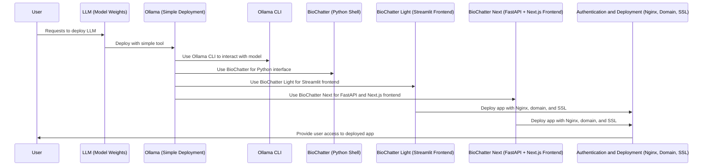
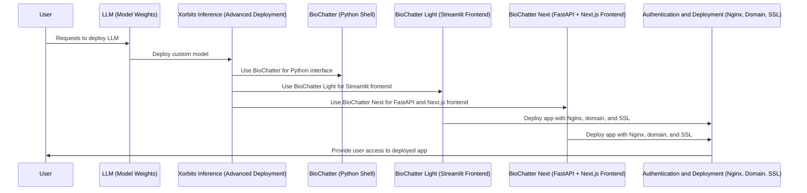

# Day 3 - Deploying LLMs in the Cloud

## Prerequisites

You should be able to connect to your assigned VM from your machine, using an
SSH client. The machine should run Ubuntu and have access to the internet, as
well as Conda, Python, and Docker.

If Conda is not installed, we can install miniforge, a minimal version of
Anaconda, by running the following commands:

```bash
curl -L -O "https://github.com/conda-forge/miniforge/releases/latest/download/Miniforge3-$(uname)-$(uname -m).sh"
bash Miniforge3-$(uname)-$(uname -m).sh
```

## Background

In this session, we will talk about LLMs and how to deploy them in the cloud.
The framework, including days 4 and 5, consists of the following components:

- The LLM: A collection of model weights from a public repository that allows
deployment of the model using specific software.

- The LLM deployment tool: A Python package that allows you to deploy a range of
LLMs on a GPU-enabled machine, such as the cloud-based VMs you have created on
Day 1.

    - Ollama: A simple deployment tool with focus on ease of use.

    - Xorbits Inference: A more advanced deployment tool that allows you to
    deploy custom models.

- Software for interfacing with the LLM: A Python package and more elaborate
frontends that allow interfacing with the user to enable tasks that use the LLM.

    - Ollama CLI: Ollama comes with its own command-line interface that allows
    quickly deploying and interacting with its models.

    - [BioChatter](https://biochatter.org): A Python package that allows you to
    interface with the LLM using a Python shell.

    - BioChatter Light: A Python-based frontend (made using
    [Streamlit](https://streamlit.io/)) that allows fast prototyping of web
    applications.

    - BioChatter Next: A more elaborate frontend solution that uses a REST API
    based on [FastAPI](https://fastapi.tiangolo.com/) and a frontend based on
    [Next.js](https://nextjs.org/).

- Authentication and deployment layer (Day 4): A software layer that allows you
to deploy your application to the internet and authenticate users. Briefly, this
involves setting up a reverse proxy using Nginx, domain specification, and
SSL certificates.

Here are diagrams for the basic and advanced deployments:

### Basic Deployment



### Advanced Deployment



We will start with [basic deployment](basic.md) in the first session, using
[Ollama](https://ollama.com). If you're done with basic deployment before the break, you can proceed
to the [advanced deployment](advanced.md) session, which introduces [Xorbits
Inference](https://inference.readthedocs.io/en/latest/index.html).

## Deploying an LLM - Basic

In the shell of the VM, we start by installing Ollama as instructed in the
[Ollama Documentation](https://ollama.com/download/linux).

```bash
curl -fsSL https://ollama.com/install.sh | sh
```

We are now already set to deploy an LLM using Ollama. A list of models can be
found [here](https://ollama.com/library). For instance, we may want to deploy
the GPT-2 model for historic reasons. It only has a size of 328 MB, and
interacting with it is fast, but quite different from the commercial models
available today. Give it a try:

```bash
ollama run mapler/gpt2
```

If we want to deploy a current state-of-the-art model, we can use the llama-3.1
model instead. You can find it at the top of the model page, as it is currently
by far the most popular model.

```bash
ollama run llama3.1
```

Without specifying the exact model variant, Ollama will deploy the default for
this model. Exercise: find out, which exact model variant is deployed by default
(size, quantisation, etc.).

### Exercise

Deploy the larger (70B) variant of the llama3.1 model, or a different model from
the Ollama library. Which differences do you notice between the models?

Further questions to consider:

- What are the effects of model size on model behaviour, deployment time, and
inference speed?

- What are the effects of model quantisation on model behaviour, deployment
time, and inference speed?

- What is the behavioural difference between completion models like GPT-2 and
instruct-tuned models like llama3.1?

Feel free to experiment with different models and see how they behave; or, if
you are interested in other deployment options, proceed to the next section.

## Deploying an LLM - Advanced

### Installing Xorbits Inference

For deploying custom models, we can use Xorbits Inference. Since this is a
Python library, we would like to install it in a Conda environment. We can do
this by creating a new environment and installing the package:

```bash
conda create -n xinference python=3.11
conda activate xinference
pip install xinference[all]
```

Xinference allows accessing multiple deployment avenues (libraries), such as
Transformers (Hugging Face), vLLM, and Llama.cpp (more info
[here](https://inference.readthedocs.io/en/latest/getting_started/installation.html#installation)).
Using the flag `[all]` installs all of them, but you can also install them
individually. Using a model in Xinference, you need to specify which backend to
use using the `Model Engine` parameter.

### Starting the XInference CLI

We are now ready to start the xinference CLI application that allows model
deployment. We add an ampersand to the command to run it in the background:

```bash
xinference-local &
```

The CLI will start a web server on port 9997 (by default), which can be accessed
in various ways, including via their GUI, from the command line, and via Python.
We will use the latter for this exercise.

### Deploying a builtin model from Python

Once the service is running, we can deploy a model using the Xinference Python
client. The following code snippet deploys the llama-3.1-instruct model:

```python
from xinference.client import RESTfulClient
client = RESTfulClient("http://127.0.0.1:9997")
model_uid = client.launch_model(
    model_name="llama-3.1-instruct",
    model_engine="llama.cpp",
    model_size_in_billions=8,
    model_format="ggufv2",
    quantization="Q4_K_M",
)
print(model_uid)                # this is the model we just deployed
print(client.list_models())     # this returns all running models
```

You can also stop any deployed model using the following command:

```python
client.terminate_model(model_uid)
```

Most importantly, we can send requests to any running model using the following
syntax:

```python
model = client.get_model(model_uid)
response = model.chat(
    messages=[
        {"role": "user", "content": "Who am I talking to?"}
    ]
)
print(response)
```

Naturally, this is not a very convenient way of having a conversation, but it is
a substantially more powerful way of programmatically interacting with the
model. Exercise: inspect the `response` object. What does it contain? How would
you use it in a real-world application?

### Xinference Models

Xinference provides a long list of builtin models, which are not just
conversational model, but also embedding, multimodal, and other types of models.
The full list can be found
[here](https://inference.readthedocs.io/en/latest/models/builtin/index.html).

Using the backends included in the library, we can also deploy custom models
using a simple configuration, which is described
[here](https://inference.readthedocs.io/en/latest/models/custom.html).

### Exercise

Experiment with the Xinference library and deploy a model of your choice
(builtin, custom, embedding, multimodal, audio, etc.). How does the deployment
process differ from Ollama? What are the advantages and disadvantages of using
Xinference over Ollama?