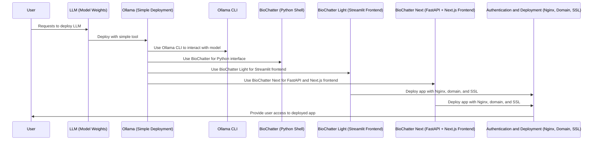
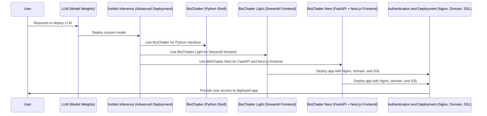

# Day 3 - Deploying LLMs in the Cloud

Table of Contents:

- [Background](#background)

- [Basic deployment](basic.md)

- [Advanced deployment](advanced.md)

## Prerequisites

You should be able to connect to your assigned VM from your machine, using an
SSH client. The machine should run Ubuntu and have access to the internet, as
well as Conda, Python, and Docker.

If Conda is not installed, we can install miniforge, a minimal version of
Anaconda, by running the following commands:

```bash
curl -L -O "https://github.com/conda-forge/miniforge/releases/latest/download/Miniforge3-$(uname)-$(uname -m).sh"
bash Miniforge3-$(uname)-$(uname -m).sh
```

## Background

In this session, we will talk about LLMs and how to deploy them in the cloud.
The framework, including days 4 and 5, consists of the following components:

- The LLM: A collection of model weights from a public repository that allows
deployment of the model using specific software.

- The LLM deployment tool: A Python package that allows you to deploy a range of
LLMs on a GPU-enabled machine, such as the cloud-based VMs you have created on
Day 1.

    - Ollama: A simple deployment tool with focus on ease of use.

    - Xorbits Inference: A more advanced deployment tool that allows you to
    deploy custom models.

- Software for interfacing with the LLM: A Python package and more elaborate
frontends that allow interfacing with the user to enable tasks that use the LLM.

    - Ollama CLI: Ollama comes with its own command-line interface that allows
    quickly deploying and interacting with its models.

    - [BioChatter](https://biochatter.org): A Python package that allows you to
    interface with the LLM using a Python shell.

    - BioChatter Light: A Python-based frontend (made using
    [Streamlit](https://streamlit.io/)) that allows fast prototyping of web
    applications.

    - BioChatter Next: A more elaborate frontend solution that uses a REST API
    based on [FastAPI](https://fastapi.tiangolo.com/) and a frontend based on
    [Next.js](https://nextjs.org/).

- Authentication and deployment layer (Day 4): A software layer that allows you
to deploy your application to the internet and authenticate users. Briefly, this
involves setting up a reverse proxy using Nginx, domain specification, and
SSL certificates.

Here are diagrams for the basic and advanced deployments:

### Basic Deployment



### Advanced Deployment



We will start with [basic deployment](basic.md) in the first session, using
[Ollama](https://ollama.com). If you're done with basic deployment before the break, you can proceed
to the [advanced deployment](advanced.md) session, which introduces [Xorbits
Inference](https://inference.readthedocs.io/en/latest/index.html).
