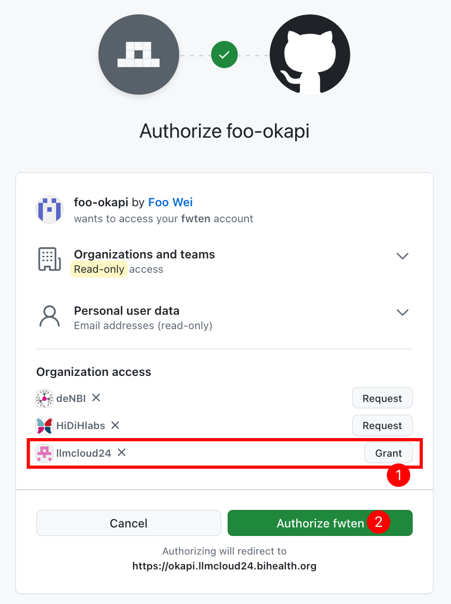

## Day 4: Pre-Authentication Mini Hands-On

Before we proceed with the Authentication part, let's just have a mini hands-on session to set up Open WebUI, which is a web interface that can be used to chat with Ollama.

First, open the  `.env` in the `04-Authentication` folder. You can do so via `nano .env` when you're inside the folder.

The content of this file will look like this. Let's focus only on the first 2 lines. Make sure you replace the values after the `=` sign with your own values! Make sure there are no spaces after the `=` too!
```bash
MY_ANIMAL=just_your_animal_name_for_the_domain
OLLAMA_IP=your_ollama_vm_internal_ip_10.X.X.X:PORT
... ignore the rest for now ...
```
For now let's just focus on line 2: `OLLAMA_IP=your_ollama_vm_internal_ip_10.X.X.X:PORT`. Change this to the `INTERNAL_IP:PORT` of the VM with Ollama running.

>[!TIP]
>You can use our Ollama if you don't want to use yours by changing the relevant line to `OLLAMA_IP=10.0.2.137:7869`

>[!TIP]
>If you still have your Ollama running on a VM from Day 3, you can keep using it. Find out the **internal IP** of this VM (should be something like 10.X.X.X), and if you followed the instructions from Sebastian, the port should be **11434**.

>[!TIP]
>If your Ollama has no models, you can run this to add the `smollm` model: `docker exec -it ollama ollama run smollm`. You can chat with it to confirm it's working, and then type `/bye` to exit.

>[!TIP]
>Otherwise if you have lost your Ollama, you can make a new GPU VM and refer to the `04-Authentication/docker-compose-ollama.yml` file. If you run your Ollama via this docker compose file, don't forget to download the model in the container: `docker exec -it ollama ollama run llama3.1`.

Save the file, and then do `source .env`, this will load the variables we just defined into your environment. To check if the changes took effect, you can do `echo $OLLAMA_IP`.

Then you can do `docker compose -f docker-compose-webui.yml up --build` to get your own Open WebUI service running.

To quickly check if it's running, you can do `curl localhost:8080 | grep "<title>".

If you see something like this, then it should be working:
```bash
$ curl localhost:8080 | grep "<title>"
  % Total    % Received % Xferd  Average Speed   Time    Time     Time  Current
                                 Dload  Upload   Total   Spent    Left  Speed
100  5971  100  5971    0     0   968k      0 --:--:-- -<title>Open WebUI</title>
    0 --:--:-- --:--:-- --:--:-- 1166k
```

Stay tuned and look into the SOCKS proxy setup session and instructions if you want to use this interface via your browser!

### Background on what we expect:

When you visit the demo page, you will reach the Nginx service. This Nginx service will then forward you to the oauth2-proxy service, which presents you with the choice to access our Open WebUI web service behind the gates via GitHub login. The oauth2-proxy will let GitHub handle the user authentication process and pass on the results to our Open WebUI service.

Here, we also restricted access to only GitHub accounts that are linked to the LLMCloud24 org, so we need to grant this permission first, before we try to authorize our user. Otherwise, they will not know that you are with the org and deny you access, as designed.

### How do we deploy them?

#### Pre-requisites:

If you intend to do this yourself, you will need the following things:
 - Request a subdomain for your VM from one of the BIH people
 - Create a New GitHub OAuth App here: https://github.com/settings/developers with the following settings:
   - Application Name: let's call it `oauth-YOUR_ANIMAL`
   - Homepage URL: `https://$yourAnimal.llmcloud24.bihealth.org/`
   - Authorization callback URL: `https://$yourAnimal.llmcloud24.bihealth.org/oauth2/callback`
   - You can leave the **Enable Device Flow** unchecked
 - After this, you can generate a **Client secrets**, make sure you note this down somewhere, or it will disappear! They are both mixtures of numbers and alphabets.
 - You can also find your **Client ID** on the same page, you need both of these.
 - In addition, generate a **cookie secret** that we will use later, so note it down somewhere: `openssl rand -hex 16`

Again, open up the `.env` file to update it with the new details.

Make sure you replace the values after the `=` sign with your own values! Make sure there are no spaces after the `=` too!
```bash
MY_ANIMAL=just_your_animal_name_for_the_domain
OLLAMA_IP=your_ollama_vm_internal_ip_10.X.X.X:PORT
OAUTH2_PROXY_CLIENT_ID=somethingsomething
OAUTH2_PROXY_CLIENT_SECRET=somethingsomething
OAUTH2_PROXY_COOKIE_SECRET=somethingsomething
```

After setting the values, save the file, and run `source .env` again. Then, you can run `docker compose -f docker-compose-oauth.yml up -d`.


## Day 4: Web App Example: OAuth + Open WebUI + Ollama

If you don't have your own set up, we have an example set up that you can visit here: https://foooauth.llmcloud24.bihealth.org/

# Pay attention to the screenshots and steps below!! Do not mess this up!!
# Step 1


# Step 2


# Step 3 and 4: Two things happening here!! GRANT/REQUEST and only then AUTHORIZE!!
>[!IMPORTANT]
>Pay attention to grant or request access to the llmcloud24 organization before clicking the green Authorize button!


