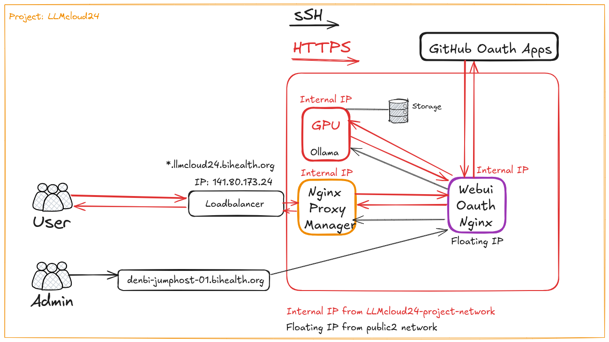
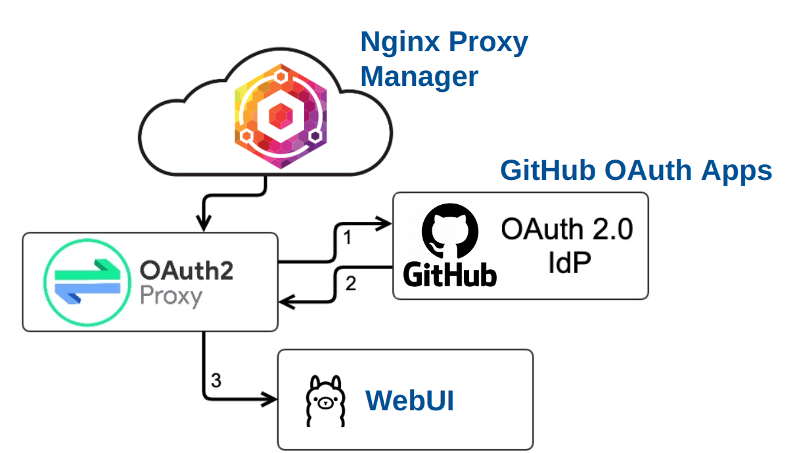
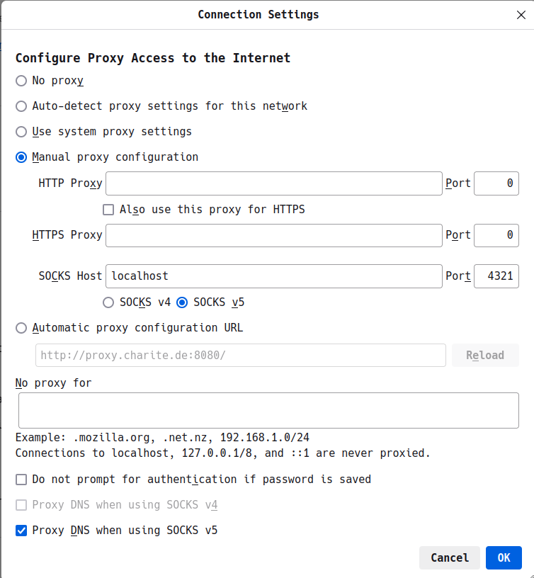
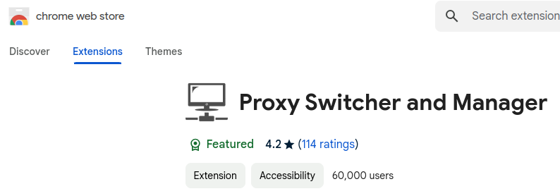
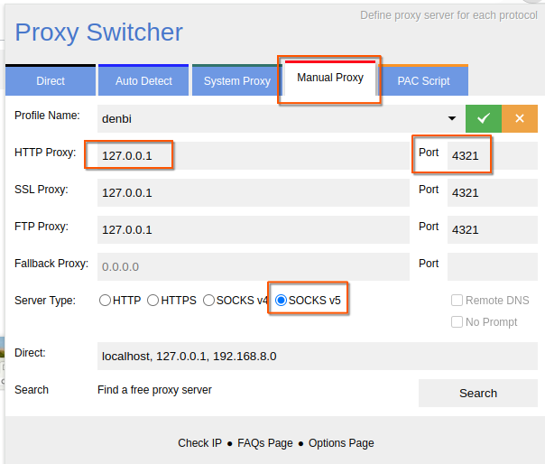

# Day 4 - How to Service – Ensuring Continuous Support throughout Operations

Table of Contents:

- [Background](#background)
- [Certification](#certification)
- [Authentication](#authentication)
- [Monitoring](#monitoring)
- [Backups](#backups)
- [SOCKS proxy](#socks-proxy)

## Background

Ensuring continuous support throughout operations is crucial for maintaining the reliability, security, and efficiency of any system or service. This session we will discuss the key components that underpin robust operational support, including certification, authentication, monitoring, and backups. By understanding and implementing these elements effectively, organizations can minimize downtime, protect sensitive data, and provide seamless experiences for users.

## 0 General Project Setup

You will need a VM for the LLM setup:
- Flavor: de.NBI GPU T4 medium
- Image: Ubuntu-24.04-20240913-gpu
- Network: LLMcloud24-network-2

Please set up another smaller VM for the WebUI+OAuth setup:
- Flavor: de.NBI default
- Image: Ubuntu-24.04-20240913-gpu
- Network: LLMcloud24-network-2

An overview of the planned project setup



>[!TIP]
>You, as a participant in this Summer School, are one of the Admins in this overview. The Users would be the users you want to service, once you have your things deployed and running.

## Deploying ollama with docker setup

>[!TIP]
>If you ever feel like you messed up your docker stuff, you can try to run this to purge everything:
>```docker stop $(docker ps -q) ; docker rm $(docker ps -a -q) ; docker rmi $(docker images -q) ; docker volume rm $(docker volume ls -q) ; docker network rm $(docker network ls -q) ; docker system prune -a --volumes```
>You could do this if you want to have something closer to a fresh-start.

Deploy ollama with Docker without Github Oauth authentication

```
docker compose -f docker-compose-ollama.yml up --build
```

How to run a model now inside the container e.g.
```
docker exec -it ollama ollama run smollm
```

## 1 Monitoring

Ongoing monitoring of system and application performance, security, and infrastructure health enables early issue detection and swift resolution.

## 2 Backups

Regular, secure backups following strategies to ensure that data can be restored after loss or corruption, maintaining operation continuity. Implementing automated backup solutions and storing backups in multiple locations safeguards against various failure scenarios and minimizes downtime.

In this session, we showed and talked about:
 - the important properties of a backup system: separation, restorability, automation, monitoring
 - what are **NOT** backups: snapshots, syncs, RAIDs, ...
 - how to add extra volume to the VMs on OpenStack, focusing on the NFS shares.
 - access the NFS share from the VM
 - how to make backups
 - how to validate/restore backups
 - how to automate these steps
 - how to monitor this setup

## 3 Certification
Implementing TLS (Transport Layer Security) certificates to secure data transmission ensures encrypted communication between clients and servers, protecting sensitive information from interception and tampering.

## 4 Authentication

Integrating robust authentication methods to prevent unauthorized access and enhance security to ensure that only authorized users can access critical systems and data.




>[!IMPORTANT]
>The following SOCKS proxy setup is not strictly required to proceed with the Summer School courses, especially if you focus on using the service with OAuth and received your animals and the URLs.
>Nevertheless, this part is crucial if you plan to do more things on the de.NBI or other cloud infrastructures, and you need to interact with your services in the browser.

## Extra: How to access internal Network with Socks Proxy

A SOCKS proxy (Socket Secure) is an internet protocol that routes network traffic between a client and a server via a proxy server. Unlike traditional proxies, SOCKS operates at the transport layer, handling any type of traffic, such as HTTP, FTP, and SMTP. It offers more flexibility, as it doesn’t interpret or modify network traffic, making it suitable for a wide range of applications, including web browsing, file transfers, and peer-to-peer networks. SOCKS5, the latest version, adds support for authentication and UDP traffic, improving security and performance for various use cases.

### Introduction

In our case we use a SOCKS5 proxy to reach an internal network. The connection to the internal netwok can then be used by the browser to show web pages that are not reacheable from the internet but only from inside the de.NBI cloud. 

Basically, you need 3 things:
1. A new entry in your ssh config file with DynamicForward
2. Set up your browser to utilize this proxy
3. An active SSH session to this newly added host

### Setup

The proxy server in this case is created on the local machine or 'localhost'. To establish the SOCKS5 proxy a ssh connection with a specific port is created. To use the connection the browser proxy settings must be changed to use 'localhost' on the port defined in the ssh connection as a SOCKS5 proxy. Now the browser (client) can connect to the server in the de.NBI cloud.

### SSH config

```config
Host de.NBI-socks-proxy
    HostName denbi-jumphost-01.bihealth.org
    User jakobmathis
    IdentityFile ~/.ssh/privkey.key
    DynamicForward 127.0.0.1:4321
    ServerAliveInterval 120
```

Entry in the ssh config.

>[!IMPORTANT]
>You need to keep an active SSH session to this host for this to work.

### Browser settings

The easiest way to setup the proxy in the browser is by changing the browser settings.



You can also add an extension like the "Proxy Switcher and Manager" to the browser. This extension should work with [chrome](https://chromewebstore.google.com/detail/proxy-switcher-and-manage/onnfghpihccifgojkpnnncpagjcdbjod), [edge](https://microsoftedge.microsoft.com/addons/detail/proxy-switcher-and-manage/gneeeeckemnjlgopgpchamgmfpkglgaj) and [firefox](https://addons.mozilla.org/en-US/firefox/addon/proxy-switcher-and-manager/).



With the extension installed you can setup multiple configurations for each connection you want to have and change the proxy settings by clicking on the correct tab. The default tab is 'System Proxy', when selected the browser will use the global proxy settings from the operating system. The tab for using the SOCKS proxy is 'Manual Proxy'.
Give the ip address of localhos 127.0.0.1 and fill in the port of the ssh connection, 4321. Select 'SOCKS v5' as 'Server Type'. Give the connection a recognizable name and save it by clicking on the green checkmark.



## Extra: Configuring your NGINX loadbalancer/reverse proxy for ollama/openwebui:

If you want to use a separate nginx loadbalancer or reverse proxy on top of your VMs, you can try out the following nginx config.

These are the assumptions:
- your domain is `https://llm.domain.com`
- you have your own certs
- your openwebui is running internally on `10.0.1.123:8080`

When you go to `https://llm.domain.com`, you will now reach your openwebui interface running on `10.0.1.123:8080`!

```
server {
        listen 443 ssl default_server;
        listen [::]:443 ssl default_server;
        ssl_certificate </path/to/certs>;
        ssl_certificate_key </path/to/certs>;
        ssl_protocols TLSv1.2 TLSv1.3;
        ssl_ciphers 'ECDHE-ECDSA-AES256-GCM-SHA384:ECDHE-RSA-AES256-GCM-SHA384';
        ssl_prefer_server_ciphers on;

        server_name llm.domain.com; # maybe add internal ips if needed

        location / {
            proxy_set_header   X-Real-IP $remote_addr;
            proxy_set_header   X-Forwarded-For $proxy_add_x_forwarded_for;
            proxy_set_header   X-Forwarded-Proto $scheme;
            proxy_set_header   Host $http_host;
            proxy_set_header Upgrade $http_upgrade;
            proxy_set_header Connection "upgrade";
            proxy_http_version 1.1;
            proxy_pass http://10.0.1.123:8080;
        }

        location /ws/ {
            proxy_set_header Upgrade $http_upgrade;
            proxy_set_header Connection "Upgrade";
            proxy_set_header Host $host;
            proxy_http_version 1.1;
            proxy_pass http://10.0.1.123:8080;
        }
```
